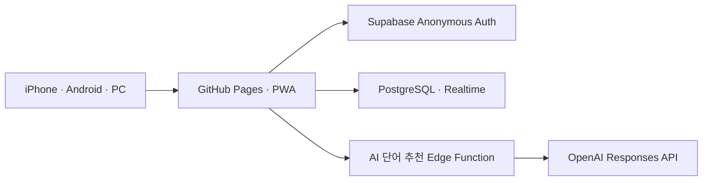

# Bingo Club PWA

iPhone, Android, 태블릿, PC에서 같은 코드로 실행되는 터치 중심 빙고 게임입니다. 기본 주제 사전만으로 혼자 플레이할 수 있고, Supabase를 연결하면 방 코드와 QR로 여러 기기가 실시간 참가할 수 있습니다.

## 주요 기능

- 3×3, 4×4, 5×5, 6×6 빙고판
- 숫자 또는 주제 단어 빙고
- 빙고 칸보다 많은 후보 단어 추천
- 모바일의 `칸 → 단어`, `단어 → 칸` 터치 배치
- PC의 후보 단어 드래그 배치
- 나머지 자동 채우기, 위치 섞기, 직접 단어 추가
- 칸 터치로 표시하고 다시 터치해 취소
- 가로·세로·대각선 빙고 자동 계산
- 닉네임, 방 코드, QR 초대, 참가자별 빙고 현황
- 게임 생성 직후 초대 URL 표시·복사·모바일 공유
- 선택·취소·빙고·시작·종료 이벤트 기록
- 기기 내 최근 게임 결과 저장
- iOS/Android 홈 화면 설치가 가능한 PWA
- `main` 브랜치 변경 시 GitHub Pages 자동 배포

## 동작 구조



Supabase 환경변수가 없으면 앱은 자동으로 로컬 모드로 실행됩니다. 빙고 생성·편집·플레이·기기 내 기록은 사용할 수 있지만 다른 휴대폰의 방 참가는 사용할 수 없습니다.

## 로컬 실행

Node.js 20 이상이 필요합니다.

```bash
npm install
npm run dev
```

검증 명령은 다음과 같습니다.

```bash
npm run test:run
npm run typecheck
npm run build
```

## Supabase 연결

처음 설정한다면 먼저 **[Supabase 온라인 멀티플레이 설정 가이드](SUPABASE_SETUP.md)**를 순서대로 따라 하세요. Dashboard에서 눌러야 할 메뉴, GitHub Secret 등록, 휴대폰 2대 테스트와 오류 해결 방법까지 설명합니다.

### 1. 프로젝트와 익명 로그인 준비

1. Supabase에서 새 프로젝트를 만듭니다.
2. Authentication 설정에서 **Anonymous Sign-Ins**를 활성화합니다.
3. SQL Editor에서 [`supabase/migrations/20260902000000_init_bingo.sql`](supabase/migrations/20260902000000_init_bingo.sql)을 실행합니다.

마이그레이션은 게임, 참가자, 이벤트 테이블과 RLS 정책, Realtime publication을 함께 구성합니다.

### 2. 로컬 환경변수

```bash
cp .env.example .env.local
```

`.env.local`에 Supabase Project URL과 Publishable key를 입력합니다. 환경변수 이름은 기존 호환성을 위해 `VITE_SUPABASE_ANON_KEY`를 유지합니다.

```dotenv
VITE_SUPABASE_URL=https://YOUR_PROJECT.supabase.co
VITE_SUPABASE_ANON_KEY=YOUR_SUPABASE_PUBLISHABLE_KEY
```

프런트엔드에는 반드시 `sb_publishable_...` 형식의 Publishable key를 사용합니다. 레거시 anon key도 호환되지만 신규 설정은 Publishable key가 권장됩니다. `sb_secret_...` 또는 `service_role` key는 넣지 마세요. 데이터 변경 권한은 SQL에 포함된 RLS 정책으로 제한됩니다.

### 3. 선택 사항: 사전에 없는 주제의 AI 추천

기본 사전은 과일, 동물, 음식, 여행, 스포츠, 학교, 회사, 인공지능, 수술실, 영화 주제를 지원합니다. 다른 주제까지 자동 추천하려면 Supabase CLI로 Edge Function을 배포합니다.

```bash
supabase login
supabase link --project-ref YOUR_PROJECT_REF
supabase functions deploy suggest-words
supabase secrets set OPENAI_API_KEY=YOUR_OPENAI_API_KEY
supabase secrets set OPENAI_MODEL=gpt-4o-mini
```

AI 키는 Supabase Edge Function의 서버 환경에만 저장되며 브라우저 번들에 포함되지 않습니다. 함수는 OpenAI Responses API의 Structured Outputs를 사용해 `{ "words": [...] }` 형식을 강제합니다.

## GitHub Pages 배포

### 1. 저장소 Secret 등록

GitHub 저장소의 `Settings → Secrets and variables → Actions`에서 다음 Repository secrets를 추가합니다.

- `VITE_SUPABASE_URL`
- `VITE_SUPABASE_ANON_KEY`

Supabase 없이 로컬 모드만 배포하려면 두 Secret을 등록하지 않아도 됩니다.

### 2. Pages 활성화

GitHub 저장소의 `Settings → Pages → Build and deployment`에서 Source를 **GitHub Actions**로 선택합니다.

이후 `main`에 push할 때 [`.github/workflows/deploy-pages.yml`](.github/workflows/deploy-pages.yml)이 테스트와 빌드를 수행한 뒤 Pages에 배포합니다.

배포 기본 주소:

```text
https://hwigooon.github.io/bingo-pwa/
```

## 휴대폰에 설치

- iPhone/iPad: Safari에서 배포 주소 열기 → 공유 → **홈 화면에 추가**
- Android: Chrome에서 배포 주소 열기 → 메뉴 → **앱 설치** 또는 **홈 화면에 추가**

## 데이터 모델

| 테이블 | 역할 |
|---|---|
| `games` | 방 코드, 주제, 크기, 후보 단어, 게임 상태 |
| `game_players` | 닉네임, 개인 빙고판, 표시 칸, 빙고 수 |
| `game_events` | 참가, 선택, 취소, 빙고, 시작, 종료 기록 |

로그인은 회원가입 화면 없이 Supabase Anonymous Auth로 처리합니다. 같은 브라우저에서는 익명 세션을 유지하므로 페이지를 새로 열어도 기존 플레이어로 방에 다시 들어갈 수 있습니다.

## 프로젝트 구성

```text
src/
  components/       화면과 게임 UI
  data/topics.ts    오프라인 기본 주제 사전
  lib/bingo.ts      빙고 계산과 보드 생성
  lib/game-service.ts
                    Supabase CRUD와 Realtime 구독
supabase/
  migrations/       DB 스키마와 RLS 정책
  functions/        AI 단어 추천 Edge Function
.github/workflows/  GitHub Pages 자동 배포
```
